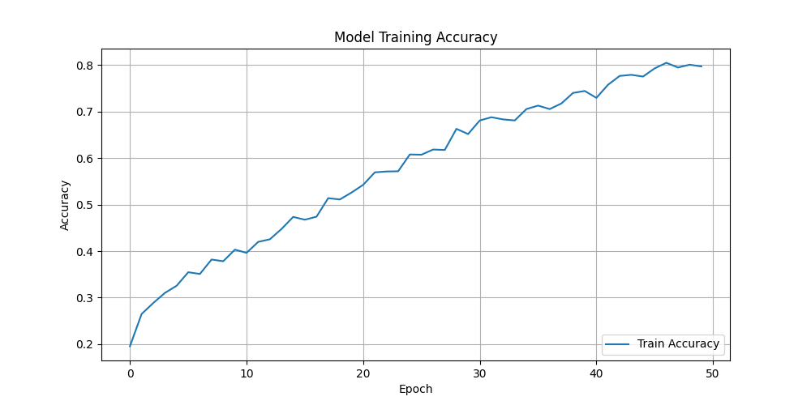

# Car-Brand-Recognition-CNN

Custom Convolutional Neural Network (CNN) built with TensorFlow/Keras for detecting cars and recognizing their brand/model in images. Includes data augmentation and a simple training and prediction pipeline.

---


## Project Overview

This project builds a custom Convolutional Neural Network (CNN) using TensorFlow/Keras to detect cars and recognize their brand/model in images. The network is trained using a car dataset (e.g., from Kaggle), with image augmentation. The model predicts a single class label for each image.

**Supported Car Classes:**
- Audi
- Hyundai Creta
- Mahindra Scorpio
- Rolls Royce
- Swift
- Tata Safari
- Toyota Innova
- no_car (negative samples)


### Dataset Sources and Usage

The dataset used in this project was obtained from:

**Car Images:** https://www.kaggle.com/datasets/kshitij192/cars-image-dataset
  - For more balanced and faster training, 270 images of each class (including no_car) were used for training, and 67 images of each class (including no_car) for testing, creating a manual 80/20 train/test split.

**No-Car Images:** https://www.kaggle.com/datasets/puneet6060/intel-image-classification
  - Used to create the `no_car` class for negative samples.

**How the images are used:**
- The images from the `train` folder are used for training the model.
- The images from the `test` folder are used for testing and evaluating the model's performance.
  - This matches the code in `cnn.py`, which loads images from `train/` for training and from `test/` for evaluation.

---


## About Convolutional Neural Networks (CNNs)

Convolutional Neural Networks (CNNs) are deep learning models designed for image recognition. They use convolutional layers to extract features, pooling layers to reduce dimensionality, and dense layers for classification. This project uses a custom CNN architecture (not transfer learning) for car brand recognition.

---


## Project Implementation

This project uses a custom Sequential CNN model built from scratch. No transfer learning or pre-trained models are used.

### Data Augmentation

The training pipeline uses `ImageDataGenerator` with the following augmentations:

```python
train_datagen = ImageDataGenerator(
    rescale=1. / 255,
    rotation_range=15,
    width_shift_range=0.1,
    height_shift_range=0.1,
    shear_range=0.1,
    zoom_range=0.1,
    horizontal_flip=True,
    fill_mode='nearest'
)
```

### Model Architecture

The model consists of several Conv2D, BatchNormalization, MaxPooling2D, Dropout, Flatten, and Dense layers. The final layer uses softmax activation for multi-class classification.

**Loss:** `sparse_categorical_crossentropy` (integer labels)

**Optimizer:** Adam (default learning rate 0.001)

**Epochs:** 50 (default)

---


## Code Explanation with Snippets

### Model Architecture (cnn.py)

```python
model = Sequential()
model.add(Conv2D(32, (3, 3), activation='relu', input_shape=(IMAGE_SIZE, IMAGE_SIZE, 3)))
model.add(BatchNormalization())
model.add(MaxPooling2D(pool_size=(2, 2)))
model.add(Conv2D(64, (3, 3), activation='relu'))
model.add(BatchNormalization())
model.add(MaxPooling2D(pool_size=(2, 2)))
model.add(Conv2D(128, (3, 3), activation='relu'))
model.add(BatchNormalization())
model.add(MaxPooling2D(pool_size=(2, 2)))
model.add(Dropout(0.3))
model.add(Conv2D(256, (3, 3), activation='relu'))
model.add(BatchNormalization())
model.add(MaxPooling2D(pool_size=(2, 2)))
model.add(Dropout(0.3))
model.add(Conv2D(512, (3, 3), activation='relu'))
model.add(BatchNormalization())
model.add(MaxPooling2D(pool_size=(2, 2)))
model.add(Dropout(0.4))
model.add(Flatten())
model.add(Dense(512, activation='relu'))
model.add(Dropout(0.5))
model.add(Dense(256, activation='relu'))
model.add(Dropout(0.5))
model.add(Dense(len(class_names), activation='softmax'))
```

**Explanation:**
- Stacks multiple Conv2D, BatchNormalization, MaxPooling2D, and Dropout layers
- Ends with Dense layers and a softmax output for multi-class classification

### Training Process

The model is trained in a single phase using the training images in the `train/` folder. No separate validation or test set is used by default.

```python
history = model.fit(
    train_generator,
    epochs=EPOCHS
)
model.save('car_cnn_model.h5')
```

### Prediction

To predict the class of a new image:

```python
python cnn.py --predict path_to_image.jpg
```

The script will print the predicted class and confidence. If confidence is low, it will print a warning.

---


## Training

Training is performed on the images in the `train/` directory, organized by class folders. The model uses data augmentation and trains for 50 epochs by default. No explicit validation or test set is used in the script, but you can split your data manually if needed.

---


## Prediction

After training, you can use the script to predict the class of a new image:

```bash
python cnn.py --predict path_to_image.jpg
```

The script will output the predicted class and confidence percentage.

---


## Results Visualization

The accuracy of the model during training is visualized below:



You can also use matplotlib to visualize the training history (accuracy and loss) if desired. Example:

```python
plt.plot(history.history['accuracy'], label='train_acc')
plt.plot(history.history['loss'], label='train_loss')
plt.legend()
plt.show()
```

----

## Setup & Usage Instructions


### Prerequisites

Install the required dependencies:

```bash
pip install tensorflow keras numpy matplotlib pillow
```

### Project Structure

```
Car-Brand-Recognition-CNN/
├── cnn.py                # Main training and prediction script
├── car_cnn_model.h5      # Saved model weights
├── train/                # Training images (organized by class)
│   ├── Audi/
│   ├── Hyundai Creta/
│   ├── Mahindra Scorpio/
│   ├── Rolls Royce/
│   ├── Swift/
│   ├── Tata Safari/
│   ├── Toyota Innova/
│   └── no_car/
```

### How to Run

1. **Prepare your dataset** — Place training images in `train/`, organized by class folders

2. **Train the model:**
    ```bash
    python cnn.py
    ```

3. **Make predictions:**
    ```bash
    python cnn.py --predict path_to_image.jpg
    ```

### Configuration

Adjust these parameters in `cnn.py` as needed:

```python
IMAGE_SIZE = 128           # Input image size
EPOCHS = 50                # Number of training epochs
```

---

## License and Credits

- **TensorFlow/Keras** — Deep learning framework used for model development


This project was developed as a university assignment to demonstrate CNN-based image classification using a custom deep learning model.

---

## Author

Built with TensorFlow/Keras for educational purposes.
